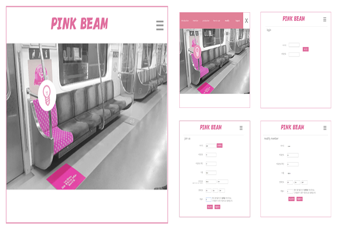

# PINKBEAM

About 아두이노와 안드로이드 앱 연동을 통하여 임산부의 보다 편안한 대중 교통 이용을 도와주는 작품

### 기능

- 안드로이드와 웹 DB를 연동하여 회원가입, 로그인, 회원 수정 가능
- ESP8266(WiFi 모듈)을 통해 앱과 연동 성공 시 빛 제어 가능

### 개발 환경

- Linux(학교 서버)

### 개발 언어

- PHP
- Android
- Arduino
- MySQL

### 기여도

- 55% (PHP, Android, MySQL)

* PHP와 MySQL을 이용한 회원가입 및 소개 페이지
* Android 와 PHP, MySQL을 이용한 연동
* 로그인, 회원가입, 아두이노 연동을 위한 Android 개발

####스마트 ICT 프로젝트 경진대회 우수상 (2018-2학기)
